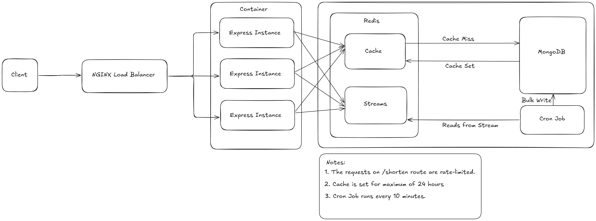
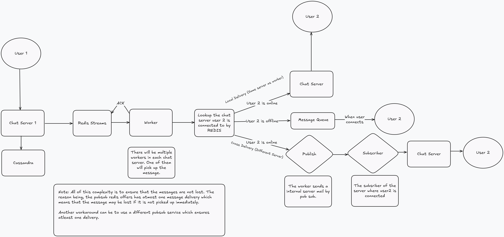
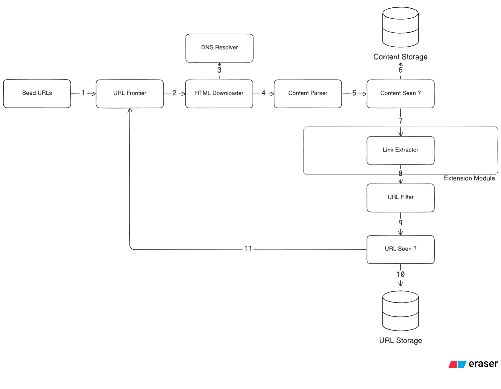

  

  <em>Computer Science student at NIT Durgapur passionate about scalable systems, backend architecture, and performance optimization.</em>

---

## About Me

- 🎓 Final-year **CS Engineering** at **NIT Durgapur** · **9.71 CGPA**
- 🧠 I learn by building from scratch — BitTorrent clients, web crawlers, chat systems
- 🔬 I treat every project like a systems paper: define the bottleneck, architect around it, then benchmark until the numbers prove it
- 🛠️ Currently deep in **Go** — building protocol-level and infrastructure projects to sharpen my systems thinking
- 🏅 **JPMC Code For Good 2025** selectee 
- 📫 **gangulyshivam6@gmail.com**

---

## Featured Systems

### 🔗 High-Performance URL Shortener &nbsp; 

**Problem**
- URL shortening services at scale face bottlenecks in redirect latency, database write throughput, and cache invalidation under concurrent load

**Solution**
- Multi-tier architecture with **Redis caching**, **NGINX reverse proxy**, and **containerized Node.js workers** behind a load balancer
- Write-behind caching and connection pooling to minimize database round-trips

**Outcome**
- **700+ req/s** sustained throughput · **sub-500ms p99 latency**
- Horizontally scalable via Docker Compose
- Benchmarked with `wrk` under sustained concurrent connections

  

### 💬 Real-Time Chat System &nbsp; 

**Problem**
- Scalability bottlenecks in monolithic WebSocket servers
- High-volume write saturation on relational databases
- Message loss during cross-server delivery in clustered environments

**Solution**
- Decoupled multi-service architecture (HTTP, Chat WS, Presence WS) behind **NGINX** to isolate concerns and scale independently
- Multi-database strategy: **PostgreSQL** for relational metadata, **Apache Cassandra** for append-heavy message logs
- **Redis Streams** for "at-least-once" message delivery and a centralized **Redis directory** for cross-server routing

**Outcome**
- **721+ msg/s** sustained throughput · **4.3ms mean handshake latency**
- **99.5% success rate** under enterprise stress tests (8,400+ total vusers)
- **5x throughput improvement** over baseline via multi-layered caching (Bloom filters + Redis) and connection pool optimization

  

### 🚀 Go BitTorrent Client &nbsp; 

**Problem**
- Traditional HTTP downloads are fragile — a dropped connection means lost progress
- Concurrent peer coordination, binary protocol parsing, and shared state management across goroutines
- Graceful handling of unreliable network peers (timeouts, chokes, disconnects)

**Solution**
- Full **BitTorrent v1.0 protocol** in **Go** — handshake, bitfield exchange, pipelining, and SHA-1 piece verification
- **Central Dispatcher ("Manager") pattern** with bitfield-aware piece assignment and fire-and-forget goroutine model
- Per-peer mutexes for maximum download parallelism
- Defensive state management: dead peers permanently banned, connection deadlines reset post-handshake, nil-safe cleanup

**Outcome**
- Fully functional concurrent distributed file transfer over **TCP**
- Parallel piece downloads across the entire peer swarm with **per-peer locking** (zero cross-peer contention)
- Robust error recovery — survived flaky peers, broken pipes, and silent timeouts without crashes

### 🕷️ Concurrent Web Crawler &nbsp; 

**Problem**

- Duplicate fetches waste crawl budget — page X → A and page Y → A both enqueue A without deduplication
- Spider traps (infinite generated pages like `/events/2026/02/`, `/2026/03/`…) consume the entire crawl run on junk
- DNS lookup overhead compounds across thousands of requests to the same domains
- Politeness violations (hammering a single host) trigger IP bans and honeypot detection
- Coordinating URL prioritization, per-host rate limiting, and content deduplication across concurrent workers

**Solution**

- Two-stage frontier: 5 priority queues ranked by OpenPageRank scores (weighted random with exponential decay) → 5 back queues with domain-affinity routing for per-host politeness
- Two-tier URL deduplication: Redis Bloom Filter as a fast "definitely not seen" gate (~1ms), DynamoDB as ground truth for false positives — eliminates ~90% of DB reads
- DynamoDB conditional writes (`attribute_not_exists`) for atomic content storage without read-before-write overhead
- robots.txt compliance with cached Disallow path matching to avoid spider traps and honeypots
- DNS caching via dnscache, SHA-256 content hashing, and go-readability parsing to strip boilerplate before storage
- 5 fetcher workers + 5 processing workers with channel-based coordination

**Outcome**

- ~4 fresh pages/second on a single instance (full pipeline: DNS → robots.txt → fetch → extract → hash → Bloom filter → DynamoDB write)
- Interface-driven architecture (`Frontier`, `Fetcher`, `Parser`, `Storage`, `Metrics`) — swapped from in-memory maps to DynamoDB + Redis with zero changes to the crawl loop
- Correctly avoids spider traps, honeypots, and duplicate work across the entire crawl

  

---

## 💼 Experience

### Research Assistant · NIT Durgapur CS Department
**August 2024 – October 2024**

- Developed an EEG signal analysis pipeline processing **15+ datasets**, achieving a **30% improvement in algorithmic efficiency** through optimized computation of Alpha-Beta and Theta-Beta ratios
- **Automated the analysis reporting workflow**, reducing manual processing effort by **60%** and enabling reproducible batch analysis across datasets
- Collaborated with **2 PhD scholars** to refine signal processing algorithms, improving data accuracy by **20%**
- Reduced per-dataset processing time by **40%** through GUI and pipeline optimizations

---

### 🖥️ Core Systems & Languages

  
  
  
  
  
   

### 🏗️ Infrastructure & Performance

  
  
  
  
  
  
  
  
  

<b>🎨 Frontend & Other Tools (Click to expand)</b>

 

  
  
  
  

---

## 🏆 Achievements

| Achievement | Detail |
|---|---|
| 🏅 **JPMC Code For Good 2025** | Selected participant — scalable tech solutions for NGOs |
| 🎯 **JEE Mains 2022** | AIR 7.9K / 1M+ candidates |
| 📈 **Academic** | 9.71 CGPA at NIT Durgapur |

---

---

  <strong>"Design for scale. Build for clarity. Measure everything."</strong>

